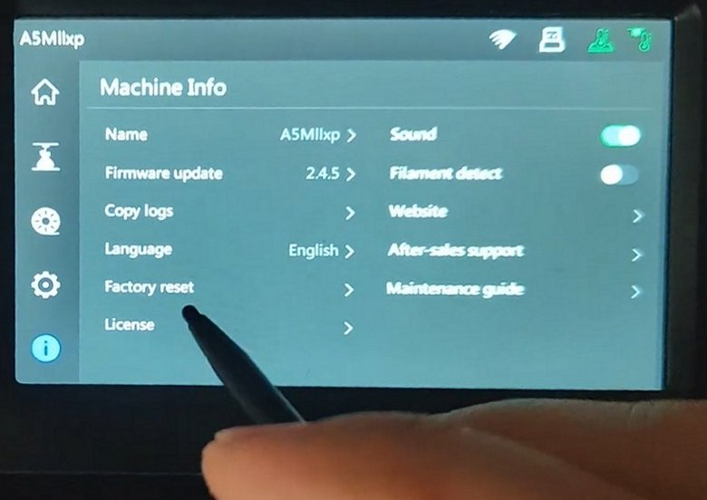
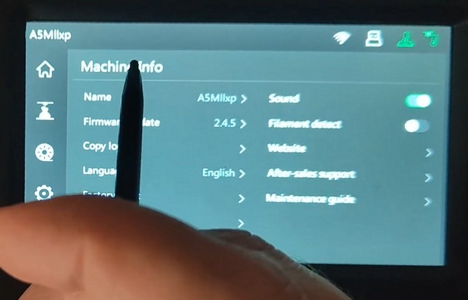
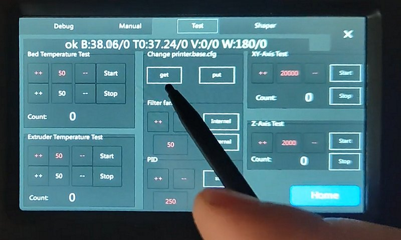

<div align="center">


# Centaur Calibration Assistant

A helper tool for Centaur Adventurer 5M/X calibration: visual leveling guidance, bed mesh visualization, quick Input Shaper utilities.

> ⚠️ **Important:** Please update to the latest version immediately — this release fixes multiple critical issues affecting mesh analysis and SSH downloads.

</div>

---

## Features

- **Visual Leveling Guidance**  
  A three-step workflow (Z-rods, screws, tape) with automatic rotation direction hints and visual feedback. The visualization is available in 2D, 3D, and animated screw rotation modes.

- **Input Shaper**  
  Import CSV logs, compute optimal shapers, generate `printer.cfg` commands, and view amplitude plots.

- **SSH Tools**  
  Connect to your printer, download `printer.cfg` and shaper files directly from the interface — no more lost paths.

- **Themes and Localization**  
  Light and dark themes, with instant language switching between Russian and English.

- **Convenient Settings**  
  With *screw-mode* you can toggle the “who turns whom” logic (screw vs. nut). Includes threshold and thermal drift controls.

- **Legacy Mode (tkinter)**  
  A simplified legacy UI version is still available in the `app/` folder — useful for experiments or lightweight setups.

---


---

## How to Get Bed Mesh on Stock Firmware (No SSH)

If you have stock firmware you need to download printer config using the **service menu** and a **flash drive**.

1. Insert your flash drive into the printer.  
2. Press the **(i)** icon to open the *Machine Info* screen.  
3. Press and hold the “Machine Info” text for about **10 seconds** until the service menu appears.  
4. Go to the **Test** tab (top of the screen), then inside the box **“Change printer.base.cfg”** press **[get]**.  
5. Remove the flash drive and insert it into your computer.  
6. Open `printer.cfg` from the flash drive in the Calibration Assistant.

<div align="center">
  
  
  
</div>


## Dependencies

See `requirements.txt` for exact details.  
Requires Python ≥ 3.9 and the following packages:

```
PySide6        # main GUI
numpy          # matrix and mesh calculations
matplotlib     # charts and animations
scipy          # interpolation and smoothing
paramiko       # SSH
python-scp     # file transfer from printer
Pillow         # static assets and Tk visuals
tkinterdnd2    # drag & drop in legacy UI
sv-ttk         # Tk themes
```

`tkinter` is part of the standard library, but on Linux you may need to install `python3-tk`.

---

## Quick Start

```bash
git clone https://github.com/lDOCI/Centaur-Calibration-Assistant-v2.git
cd Centaur-Calibration-Assistant-main\ 2
python -m venv .venv
source .venv/bin/activate             # Windows: .venv\Scripts\activate
pip install --upgrade pip
pip install -r requirements.txt
python main.py
```

On first run, directories `config/` and `languages/` will be created.  
The settings file (`config/app_settings.json`) appears after you save preferences in the app.

---

## Interface Overview

| Section | Description |
|----------|-------------|
| **Bed Leveling** | Displays 2D/3D mesh maps, status cards, and access to visual leveling hints. |
| **Input Shaper** | Load CSV, analyze X/Y axes, and get recommended shapers. |
| **SSH** | Printer access and downloading of `printer.cfg` and shaper files. |
| **Settings** | Equipment setup, thresholds, modes, and author info. |

The top bar includes theme toggle, language selector, and the “About Author” button.

---

## Project Structure

```
centaur_app/
 ├─ services/         # settings, localization, state
 ├─ ui/
 │   ├─ dialogs/      # visual guides, author dialog
 │   ├─ views/        # main UI tabs
 │   ├─ widgets/      # shared topbar, sidebar, etc.
 │   └─ assets/       # icons and images
└─ ...
app/                  # legacy tkinter interface
visualization/        # utilities for animations/meshes
config/.gitkeep       # config created at first launch
languages/            # localization JSONs
```

---

## Developer Notes

- **Virtualenv** — best way to isolate dependencies.  
- **Localization** — all strings are in `languages/*.json`. Add your language and register keys in `LocalizationService`.  
- **Visual Guides** — the generation logic is in `visualization/bed_mesh/animated_recommendations.py`. You can expand it with new hint types.  
- **Themes** — styles live in `centaur_app/ui/theme/`. Both light and dark schemes are supported, toggleable from the topbar.

---

## FAQ

**My `config/` files disappeared — is that normal?**  
Yes. The repository doesn’t include user configs like `app_settings.json` or `printer.cfg`. The app will recreate them automatically.

**Can I use it without SSH?**  
Yes, all visualization functions work with local files. SSH is just a convenience bonus.

**Why is there an `app/` folder?**  
That’s the legacy tkinter version. It’s preserved for reference or lightweight usage.

---

## Feedback

Author — [@I_DOC_I](https://t.me/I_DOC_I).  
For all questions — only in the community chat. The author doesn’t reply to private messages.

---

Good calibration and perfect first layers!

---

# 🇷🇺 Русская версия

<div align="center">


# Centaur Calibration Assistant

Помощник по калибровке принтера Centaur Adventurer 5m/x: наглядные рекомендации, визуализация сеток, быстрая работа с Input Shaper.

> ⚠️ **Важно:** срочно обновитесь до последней версии — в этом релизе исправлены несколько критических ошибок анализа сетки и скачивания через SSH.

</div>

---

## Что умеет приложение

- **Визуальные рекомендации по выравниванию**  
  Пошаговый workflow из трёх этапов (Z-валы, винты, скотч) с автоматическим вычислением направлений вращения и подсказками. Визуализация доступна в 2D, 3D и в виде анимации вращения винтов.

- **Input Shaper**  
  Импорт CSV-логов, вычисление оптимальных шейперов, генерация команд для printer.cfg и наглядные графики амплитуд.

- **SSH-инструменты**  
  Подключение к принтеру, скачивание `printer.cfg` и файлов шейпера прямо из интерфейса, чтобы нельзя было забыть нужные пути.

- **Темы и локализация**  
  Светлая и тёмная темы + переключение между русским и английским интерфейсами без перезапуска.

- **Удобные настройки**  
  С screw-mode можно переключать логику «кто кого крутит» (винт или гайка), есть контроль рабочих порогов и термоэффектов.

- **Легаси-режим (tkinter)**  
  В папке `app/` сохранена упрощённая версия старого интерфейса — она всё ещё запускается и может быть полезна для экспериментов.

---


---

## Как снять карту стола на стоковой прошивке (без SSH)

Если у вас стоковая прошивка, нужно получить конфигурацию принтера через **сервисное меню** и **флешку**.

1. Вставьте флешку в принтер.  
2. Нажмите на иконку **(i)**, чтобы открыть экран *Machine Info*.  
3. Нажмите и удерживайте надпись **Machine Info** около **10 секунд**, пока не появится сервисное меню.  
4. Перейдите на вкладку **Test** в верхней части экрана, затем в блоке **“Change printer.base.cfg”** нажмите **[get]**.  
5. Выньте флешку и вставьте её в компьютер.  
6. Откройте `printer.cfg` с флешки в Calibration Assistant.

<div align="center">
  
  
  
</div>


## Зависимости

Точное содержимое указано в `requirements.txt`. Для запуска нужен Python ≥ 3.9 и следующие пакеты:

```
PySide6        # основное GUI
numpy          # расчёты матриц и сеток
matplotlib     # графики и анимации
scipy          # интерполяции и сглаживание
paramiko       # SSH
python-scp     # загрузка файлов с принтера
Pillow         # статика и Tk-визуализации
tkinterdnd2    # drag & drop в legacy UI
sv-ttk         # темы для Tk
```

`tkinter` входит в стандартную библиотеку, но на Linux может потребоваться пакет `python3-tk`.

---

## Быстрый старт

```bash
git clone https://github.com/lDOCI/Centaur-Calibration-Assistant-v2.git
cd Centaur-Calibration-Assistant-main\ 2
python -m venv .venv
source .venv/bin/activate             # Windows: .venv\Scripts\activate
pip install --upgrade pip
pip install -r requirements.txt
python main.py
```

Первый запуск создаст директории `config/` и `languages/`.  
Файл настроек (`config/app_settings.json`) появится после сохранения настроек из приложения.

---

## Навигация по интерфейсу

| Раздел | Что там внутри |
|--------|----------------|
| **Bed Leveling** | Отрисовка 2D/3D карт сетки, карточки со статусом, кнопка открытия визуальных рекомендаций. |
| **Input Shaper** | Загрузка CSV, анализ осей X/Y, вывод рекомендуемых шейперов. |
| **SSH** | Доступ к принтеру, скачивание `printer.cfg` и файлов шейпера. |
| **Settings** | Настройки оборудования, порогов, рабочих режимов и авторские сведения. |

Топбар содержит переключатель темы, выбор языка и кнопку «Автор».

---

## Структура проекта

```
centaur_app/
 ├─ services/         # Настройки, локализация, состояние
 ├─ ui/
 │   ├─ dialogs/      # Визуальные рекомендации, авторский диалог
 │   ├─ views/        # Основные вкладки интерфейса
 │   ├─ widgets/      # общий TopBar, сайдбар и т. п.
 │   └─ assets/       # иконки, картинки
└─ ...
app/                  # legacy-интерфейс на tkinter
visualization/        # графические утилиты для анимаций/карт
config/.gitkeep       # конфигурация создаётся при запуске
languages/            # json-файлы локализации
```

---

## Советы разработчикам

- **Virtualenv** — лучший способ держать зависимости под контролем.  
- **Международные версии** — все строки идут через `languages/*.json`. Добавьте свой язык и подключите ключи в `LocalizationService`.  
- **Визуальные рекомендации** — логика генерации графиков находится в `visualization/bed_mesh/animated_recommendations.py`. Можно расширять новые типы подсказок.
- **Темы** — стили лежат в `centaur_app/ui/theme/`. Поддерживаются и светлая, и тёмная схемы, переключение — прямо из topbar.

---

## Часто задаваемые вопросы

**Файлы в `config/` пропали — это нормально?**  
Да. Репозиторий идёт без пользовательских `app_settings.json` и `printer.cfg`. После загрузки своих данных приложение всё создаст заново.

**Можно ли работать без SSH?**  
Да, все функции визуализации работают с локальными файлами. SSH — дополнительный бонус.

**Почему есть папка `app/`?**  
Это старая версия приложения на tkinter. Мы сохранили её как пример и на случай, если кому-то нужна облегчённая версия.

---

## Обратная связь

Автор — [@I_DOC_I](https://t.me/I_DOC_I).  
По всем вопросам — только в общий чат сообщества. В личку автор не отвечает.

---

Удачной калибровки и ровных первых слоёв!
